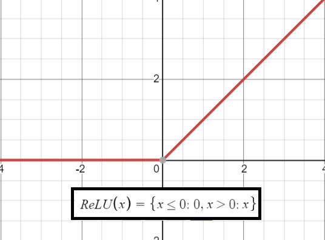
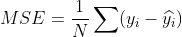

# Deep Learning and PyTorch (on the RPI)
##### IEEE Technical Workshop 10/14/2020
### Overview
[What is Deep Learning?](#what-is-deep-learning)

[Super Fast Introduction to Neural Networks](#super-fast-introduction-to-neural-networks)
* [What is a neural network](#what-is-a-neural-network)
* [Forward Propagation and Activation Functions](#forward-propagation-and-activation-functions)
* [Loss Functions](#loss-functions)
* [Backpropagation: How Networks Learn](#backpropagation-how-networks-learn)
* [An Even Faster Introduction to Convolution](#an-even-faster-introduction-to-convolution)

[What is PyTorch?](#what-is-pytorch)

[Important Pytorch Libraries](#important-pytorch-libraries)

[MNIST Example with PyTorch](#mnist-example-with-pytorch)
* [Download MNIST libraries with torchvision.datasets](#download-mnist-libraries-with-torchvisiondataset)
* [Create Model Class](#create-model-class)
* [Train Model](#train-model)
* [Test Model](#test-model)

[Adding a Convolutional Layer](#adding-a-convolutional-layer)

[Deep Learning on the RPi](#deep-learning-on-the-rpi)
* [Pickling your trained PyTorch model](#pickling-your-trained-pytorch-model)
* [Moving Your Model to your RPi](#moving-your-model-to-your-rpi)

[Next Steps](#next-steps)

[Final Code](#final-code)

[Sources](#sources)

## What is Deep Learning?
* Deep learning is a subset of machine learning, which is a field dedicated to the study and development of machines that can learn
* Basically, different iterations on the neural network
* What is deep learning used for?
    * Autonomous Driving
    * Detecting Cancer Cells
    * Object Detection
## Super Fast Introduction to Neural Networks
#### What is a neural network?
* A neural network is "based on a collection of connection units or nodes called artificial neurons, which loosely model the neurons in a biological brain. Each connection like the synapses in a biological brain, can transmit a signal to other neurons. An artificial neuron that receives a signal then processes it and can signal neurons connected to it" -- *Wikipedia*
* In most common depictions, have layers of nodes, each of which is connected to every other node in the next layer.
* neural networks essentially take one dataset (the input) and try to make it look like the another dataset (the output) by trial and error
* neural networks have been around a suprisingly long time -- it's only recently that there was enough computing power to perform all the multiplications in a reasonable time
* Neural networks are quickly becoming very prevalent in many fields other than computer vision (which brought it back to the mainstream) and can be used to solve all kinds of problems

#### Forward Propagation and Activation Functions
* At it's most basic, neural networks are composed of many layers of nodes that are connected to every node in the next layer with a strength (weight) that indicates how much a certain input correlates with each of the output nodes
    * Each node is a weighted sum of the inputs from each of the nodes from that last layer
    * Because propagation from one layer to the next is a weighted sum, it is most succintly represented as a matrix multiplication
    * Essentially, weights communicate how much an input correlates to a certain output.
      * As more and more intermediate layers are added between the input and output, it becomes harder to distinguish exactly what that weight really means in the greater scheme of the realtionship between the input and output.
* Neural nets take in one data set and try to make it look like another data set and learn by trial and error.
```python
# making a 3-layer nn: one input, one hidden layer, one output layer
import numpy as np
# creating some random matrices
data_in = np.random.random( (1, input_size ) )
weights_in_hidden = np.random.random( ( input_size, hidden_size ) )
weights_hidden_out = np.random.random( ( hidden_size, output_size ) )

# propagating forward through network
input_layer = data_in
hidden_layer = np.dot( input_layer, weights_in_hidden ) # matrix multiply, resulting matrix size ( 1, hidden_size )
output_layer = np.dot( hidden_layer, weights_hidden_out ) # resulting matrix size: ( 1, output_size )
```
* As more layers are added, becomes more beneficial to also process input to nodes before continuing to propagate in network
    * If all layers were just weighted sums with no extra processing, this can always be simplified mathematically to one weighted sum; therefore, processing data coming into nodes add complexity and additional functionality to network
* Processing in nodes usually comes in the form of a function with the domain ℝ→ℝ, usually curved or nonlinear in some way (just not a linear function)
* One famous activation function is ReLU (Rectified Linear Unit), which will turn off (set to zero) any input that is less than 0 because it negatively correlates with the data
    * Other commonly used activation function include the sigmoid and tanh


```python
import numpy as np

def relu( x ):
    return x * ( x>0 ) # x>0 returns 1 if true or 0 if false

# propagating forward through network
input_layer = data_in
hidden_layer = relu( np.dot( input_layer, weights_in_hidden ) ) # applying relu to hidden layer values
output_layer = np.dot( hidden_layer, weights_hidden_out ) 
```

#### Loss Functions
* once a prediction comes out of network, need to be able to evaluate performance of model. Use loss functions to accomplish this
* Mean Squared Error is particular popular loss function because it magnifies large errors and suppresses small errors


* Other popular loss functions include NLL Loss and Cross Entropy
#### Backpropagation: How Networks Learn
* once a prediction is made, you want to minimize the error by updating the weights of the model
* a popular algorithm to do so is Stochastic Gradient Descent (SGD), which assigns blame (error) to nodes by taking the error and doing weighted sums back through the network
* often have a learning rate, abbrievated as lr or represented as alpha, is multiplied into the weight changes to keep weight changing too rapidly from one test
```python
import numpy as np

# calculate deltas, relu_deriv returns derivative of ReLU activation function
layer_2_delta = ( true - prediction )
layer_1_delta = layer_2_delta.dot( weights_1_2.T ) * relu_deriv( layer_1 )

# update weights with delta
weights_1_2 -= alpha * layer_1.T.dot( layer_2_delta )
weights_0_1 -= alpha * layer_0.T.dot( layer_1_delta )
```
* another more recent training algorithm is Adam, which uses squared gradients to scale the learning rate and moving averages of the gradient for momentum. In many cases, Adam is much faster at optimizing that SGD
    * however, there are some instances that have show that Adam actually finds a worse solution than SGD
* when using frameworks like Tensorflow or PyTorch, backpropagation optimization algorithms like Adam and SGD are usually already implemented for you
#### An Even Faster Introduction to Convolution
* As neural networks get larger and larger, they tend to overfit (that is, to memorize instead of generalize). To combat this, use convolution layers to essentially create what are many small neural networks

Don't get convolution layers confused with kernel convolution, in which a set small matrix (usually of size 3x3 to 5x5) are used to pick out features in images like edges. Convolution layers have weights just like linear, fully-connected layers that are updated when the network is trained
    * sometimes one of the kernels in a convolutional layer is a preset kernel to pick out a certain feature, but usually those of done in preprocessing
* convolution layers are often followed by a nonlinearity (most often an activation like ReLU) and then a pooling layer, which helps output become approximately invariant to small translations of the input by downsampling (makes neural net less dependant on the location of the feature)
## What is PyTorch?
* PyTorch is a deep learning framework
    * Frameworks simplify code by eliminating repeated sections of code, allowing for faster iterations of code when testing and reduced code complexity
        * Frameworks often have structures that automatically calculate gradients and backpropagate them through the network for you
    * Frameworks are especially helpful for optimizing for training models on GPUs
* From their docs:
    * It's a Python-based scientific computing package target at two sets of audiences:
        * A replacement for NumPy to use the power of GPUs
        * a deep learning research platform that provides maximum flexibility and speed
* Uses dynamic computation graphs, like most newer frameworks
    * Think of this like dynamic vs static typing. In most cases, statically typed language will be faster and more efficient than the dynamically typed language. Of course there are things one can do with a dynamic framework that you can't do in a static framework (i.e. variable number/sequence of layers)

## Important PyTorch Libraries
* torch.nn
    * Contains layer classes
        * ex. Linear, Convolution, dropout, etc.
    * Contains container classes for neural networks
        * ex. Sequential (model as a list of layers), Module (for more custom networks)
* torch.nn.functional
    * Contains common loss and activation functions
        * ex. relu, softmax, sigmoid, tanh, nll loss, mean squared error
* torch.optim
    * contains classes for optimizer algorithms
        * ex. Adam, SGD (Stochastic Gradient Descent)

## MNIST Example with PyTorch
#### Download MNIST libraries with torchvision.dataset
```python
from torchvision import datasets, transforms

transform = transforms.Compose( [ transforms.ToTensor(), transforms.Normalize( (0.1307,), (0.3081,) ) ] )

# download datasets if not already downloaded
training_set = datasets.MNIST( "./data", train=True, download=True, transform=transform )
test_set = datasets.MNIST( "./data", train=False, download=True, transform=transform )

# get iterable data loader
train_loader = torch.util.data.DataLoader( training_set, batch_size=50 )
test_loader = torch.util.data.DataLoader( test_set, batch_size=50 )
```
* MNIST is a dataset of handwritten datasets that is extremely popular for learning neural networks
    * each digit is a 28x28 grey-scale image

#### Create Model Class
```python
import torch.nn as nn
import torch.nn.fuctional as F

class MNIST_Net( torch.nn.Module ):

    def __init__( self ):
        super( MNIST_Net, self ).__init__()
        self.linear1 = nn.Linear( 784, 100 )
        self.linear2 = nn.Linear( 100, 10 )
        self.softmax - nn.LogSoftmax( dim=1 )

    def forward( self, x ):
        hidden_relu = F.relu( self.linear( x ) )
        prediction = self.linear2( hidden_relu )
        prediction = self.softmax( prediction )
        return prediction
```
* Currently have a preliminary neural network with an input layer of 784 (28*28, the number of pixels from each MNIST image), a hidden layer of 100 nodes, and an output layer of 10 nodes (one for each digit each image could represent), which goes through a softmax operation
* These are all fully-connected layers, as represented by the class Linear
* Notice the model inherits from torch.nn.Module, as all custom models must do, as well as overload init and forward, which are needed to define what layers are in the model and how the signal propagates through them.

#### Train Model
```python
# tell pytorch where to run operations, in this case on the CPU
device = torch.device( "cpu" )
# create instance of our model
model = MNIST_Net()
# set learning rate
alpha = 1E-5
# instantiate loss function and optimizer
loss_func = nn.NLLLoss()
optimizer = torch.optim.SGD( model.parameters(), lr=alpha )

# define training function
def train( model, device, train_loader, loss_func, optimizer ):
    model.train()
    for data, target in train_loader:
        data = data.view( data.shape[0], -1 )
        data, target = data.to( device ), target.to( device )
        optimizer.zero_grad()
        output = model( data )
        loss = loss_func( output, target )
        loss.backward()
        optimizer.step()
train( model, device, train_loader, loss_func, optimizer )
```
* Here we have create a very general training functions that takes the following parameters
    * model - what model (neural network) is data being trained
    * device - where are the calculations taking place (CPU vs. GPU)
    * train_loader - iterable containing training samples
    * loss_func - what function is being used to calculate loss
    * optimizer - which optimizer to use to train the model
* Training the model goes through the following steps:
    1. reshape data to fit our model, in this case from a 28x28 picture to one long 784-tensor
    2. send tensors to correct device for optimization
    3. zero gradients (to make sure any updates are from the current iteration)
    4. predict
    5. calculate loss
    6. calculate gradients
    7. backpropagate loss with optimizer

#### Test Model
Wouldn't be too helpful if we did all that work and didn't know if it actually worked!
```python
def test( model, device, test_loader, loss_func ):
    model.eval()
    test_loss = 0
    correct = 0
    with torch.no_grad():
        for data, target in test_loader:
            data = data.view( data[0], -1 )
            data, target = data.to( device ), target.to( device )
            output = model( data )
            test_loss += loss_func( output, target )
            prediction = output.argmax( dim=1 )
            correct = prediction.eq( target.view_as( prediction )).sum().item()
    test_loss /= len( test_loader.dataset )
    print( f"Average Loss: { test_loss }\nAccuracy: { correct / len( test_loader.dataset ) }")
test( model, device, test_loader, loss_func )
```
* test function has similar parameters as the training function (except the optimizer because we're currently not training)
* in the beginning of the function, call *model.eval()*, which makes sure that any layers that help facillitate training (ex. dropout) that shouldn't function that way during forward propagation through network will act like normal layers
    * in the beginning of the training function above, we used *model.train()* to turn on those theorectical features, though in our case since we aren't currently using them, these function calls are just good practice
* the entire testing process is wrapped in a *with torch.no_grad()* context manager: this tells PyTorch not to calculate gradients for the autograd
    * saves time and memory, but not strictly necessary

## Adding a Convolutional Layer
* Modify model to add one convolutional layer + ReLU + Pooling

```python
import torch.nn as nn
import torch.nn.functional as F

# In this case, just a magic number
batch_size = 50

class MNIST_Net( torch.nn.Module ):
    
    def __init__( self ):
        super( MNIST_Net, self ).__init__()
        self.conv = nn.Conv2d( 1, 16, 3 )
        self.pooling = nn.MaxPool2d( 3, stride=1 )
        self.flatten = nn.Flatten()
        self.linear1 = nn.Linear( 16*24*24, 100 )
        self.linear2 = nn.Linear( 100, 10 )
        self.softmax = nn.LogSoftmax( dim=1 )

    def forward( self, x ):
        conv_layer = F.relu( self.conv( x ) )
        pooled_layer = self.pooling( conv_layer )
        flattened = self.flatten( pooled_layer )
        hidden_relu = F.relu( self.linear1( flattened ) )
        prediction = self.linear2( hidden_relu )
        prediction = self.softmax( prediction )
        return prediction
```

* Need to modify training and test functions slightly to put data in as a 28x28 tensor instead of one 784 size tensor

```python
def train( model, device, train_loader, loss_func, optimizer ):
    model.train()
    for data, target in train_loader:
        # comment out the following line (also in testing function)
        # data = data.view( data.shape[0], -1 )
        data, target = data.to( device ), target.to( device )
        optimizer.zero_grad()
        output = model( data )
        loss = loss_func( output, target )
        loss.backward()
        optimizer.step()
```
## Deep Learning on the RPi (Deploying somewhere else)
Raspberry Pis lack the computational power to train network; however, they are perfect for deploying and running an already trained network.
#### Pickling your trained PyTorch model
PyTorch makes it very easy to pickle a trained network and load it. Usually just pickle the state dictionary of your model, though it is possible to pickle your entire model (not recommended).
```python
# given that your instance of the neural network is bound to model, use the following line to pickle weights
torch.save( model.state_dict(), "./pickle-location-here.p" )
```
To unpickle and load your trained neural network elsewhere, you need both the pickle file and the class the model is made from
```python
# somewhere above, need to have defined class MNIST_Net()
model = MNIST_Net()
model.load_state_dict( torch.load( "./pickle-location-here.p" ) )
```
#### Moving your model to your RPi
The best ways to move your pickled file are:
* an FTP Client (ex. FileZilla)
* if already setup, ssh or scp file onto RPi

#### Running on your RPi
Running your PyTorch network is the same as how it run on your local system - load the pickled state dictionary, find some input data and feed it through the network.

*Note* - there are some strange things that happen when you try to get PyTorch onto your RPi (some version issues, wheel files, etc.) There are some nice guides on the internet to help you out :)

## Next Steps
* Look into more specific uses and cool projects for neural networks
    * computer vision
    * natural language processing
    * predicting weather
* Look into PyTorch's docs (they're surprising good) - https://pytorch.org/docs/stable/index.html
    * Learning PyTorch with Examples (recomend this) - https://pytorch.org/tutorials/beginner/pytorch_with_examples.html
* Check out different frameworks
    * tensorflow
    * keras
    * OpenCV (for computer vision)
* Look more in-depth into one area of neural networks
    * Study activation functions/loss functions
    * Look at different layer types
    * Study different optimization algorithms
        * Adam - https://towardsdatascience.com/adam-latest-trends-in-deep-learning-optimization-6be9a291375c
        * RMSprop

* Read some papers
    * [Multi-layer Neural Network](http://ufldl.stanford.edu/tutorial/supervised/MultiLayerNeuralNetworks/)
    * [Convolutional Neural Networks (CNNs / ConvNets)](https://cs231n.github.io/convolutional-networks/)
    * [Deep Residual Learning for Image Recognition](https://arxiv.org/abs/1512.03385)
    * [Weight decay](https://papers.nips.cc/paper/563-a-simple-weight-decay-can-improve-generalization.pdf)
    * [Dropout](http://jmlr.org/papers/volume15/srivastava14a.old/srivastava14a.pdf)
    * [Batch norm](https://arxiv.org/abs/1502.03167)
    * [Layer norm](https://arxiv.org/abs/1607.06450)
    * [Weight norm](https://arxiv.org/abs/1602.07868)
    * [SGD](http://ufldl.stanford.edu/tutorial/supervised/OptimizationStochasticGradientDescent/)
    * [Momentum SGD](http://ufldl.stanford.edu/tutorial/supervised/OptimizationStochasticGradientDescent/)
    * [Adam](https://arxiv.org/abs/1412.6980)
    * [Other Optimizers](https://arxiv.org/abs/1609.04747)

## Final Code
```python
import torch
import torch.nn as nn
import torch.nn.functional as F
from torchvision import datasets, transforms

class MNIST_Net( torch.nn.Module ):
    
    def __init__( self ):
        super( MNIST_Net, self ).__init__()
        self.conv = nn.Conv2d( 1, 16, 3 )
        self.pooling = nn.MaxPool2d( 3, stride=1 )
        self.flatten = nn.Flatten()
        self.linear1 = nn.Linear( 16*24*24, 100 )
        self.linear2 = nn.Linear( 100, 10 )
        self.softmax = nn.LogSoftmax( dim=1 )

    def forward( self, x ):
        conv_layer = F.relu( self.conv( x ) )
        pooled_layer = self.pooling( conv_layer )
        flattened = self.flatten( pooled_layer )
        hidden_relu = F.relu( self.linear1( flattened ) )
        prediction = self.linear2( hidden_relu )
        prediction = self.softmax( prediction )
        return prediction

batch_size, in_dim, hidden_dim, out_dim = 50, 28*28, 100, 10

transform = transforms.Compose( [ transforms.ToTensor(), transforms.Normalize( (0.1307,), (0.3081,) ) ] )

# download datasets if not already there
training_set = datasets.MNIST( "./data", train=True, download=True, transform=transform )
test_set = datasets.MNIST( "./data", train=False, download=True, transform=transform )

# get iterable data loader
train_loader = torch.utils.data.DataLoader( training_set, batch_size=batch_size )
test_loader = torch.utils.data.DataLoader( test_set, batch_size=batch_size )

device = torch.device( "cpu" )

model = MNIST_Net()
alpha = 1E-5

criterion = nn.NLLLoss()
optimizer = torch.optim.Adam( model.parameters(), lr=alpha )

def train( model, device, train_loader, criterion, optimizer ):
    model.train()
    for batch_id, ( data, target ) in enumerate( train_loader ):
        # data = data.view( data.shape[0], -1)
        data, target = data.to( device ), target.to( device )
        optimizer.zero_grad()
        output = model( data )
        loss = criterion( output, target )
        loss.backward()
        optimizer.step()

def test( model, device, test_loader, criterion ):
    model.eval()
    test_loss = 0
    correct = 0
    with torch.no_grad():
        for data, target in test_loader:
            # data = data.view( data.shape[0], -1 )
            data, target = data.to( device ), target.to( device )
            output = model( data )
            test_loss += criterion( output, target )
            prediction = output.argmax( dim=1 )
            correct += prediction.eq( target.view_as( prediction ) ).sum().item()
    test_loss /= len( test_loader.dataset )

    print( f"Epoch { epoch }: \n\tAverage Loss: { test_loss }\n\tAccuracy: { correct / len( test_loader.dataset ) }" )

for epoch in range( 10 ):
    train( model, device, train_loader, criterion, optimizer )
    test( model, device, test_loader, criterion )
```
## Sources
https://en.wikipedia.org/wiki/Artificial_neural_network
https://pytorch.org/docs/stable/index.html
https://pytorch.org/tutorials/beginner/pytorch_with_examples.html