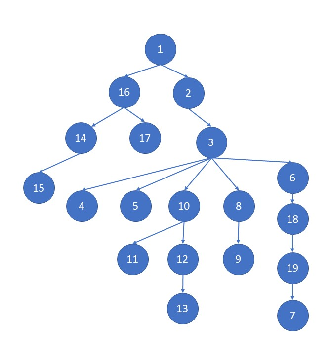

# IEEE Neural Networks Workshop 2023

# Resources
Here are some resources. They should be done in the following order.

1. [PyTorch Fashion MNIST Tutorial](https://pytorch.org/tutorials/beginner/blitz/cifar10_tutorial.html)
2. [Neural Network Overview](https://towardsdatascience.com/a-beginner-friendly-explanation-of-how-neural-networks-work-55064db60df4)
3. [Soft Intro to Neural Network Math](https://towardsdatascience.com/introduction-to-math-behind-neural-networks-e8b60dbbdeba)
4. [More Theoretical Intro to Math](https://towardsdatascience.com/simplified-mathematics-behind-neural-networks-f2b7298f86a4)
5. [Wikipedia for NN Math](https://en.wikipedia.org/wiki/Mathematics_of_artificial_neural_networks)
6. [Explanation of SGD](https://towardsdatascience.com/stochastic-gradient-descent-clearly-explained-53d239905d31)
7. [Explanation of Adam](https://machinelearningmastery.com/adam-optimization-algorithm-for-deep-learning/)
8. [Overview of Activation Functions](https://towardsdatascience.com/activation-functions-neural-networks-1cbd9f8d91d6)
9. [Wikipedia on Activation Functions](https://en.wikipedia.org/wiki/Activation_function)
10. [Loss Functions](https://towardsdatascience.com/loss-functions-and-their-use-in-neural-networks-a470e703f1e9)
11. [Loss Functions, more depth](https://machinelearningmastery.com/loss-and-loss-functions-for-training-deep-learning-neural-networks/)
12. [Intro to Convolutional Neural Networks](https://towardsdatascience.com/a-comprehensive-guide-to-convolutional-neural-networks-the-eli5-way-3bd2b1164a53)
13. [Convolutional Neural Networks Wikipedia](https://en.wikipedia.org/wiki/Convolutional_neural_network)
14. [Intro to PyTorch AutoGrad](https://pytorch.org/tutorials/beginner/introyt/autogradyt_tutorial.html)
15. [PyTorch AutoGrad](https://pytorch.org/tutorials/beginner/basics/autogradqs_tutorial.html)
16. [PyTorch Quickstart](https://pytorch.org/tutorials/beginner/basics/quickstart_tutorial.html)
17. [PyTorch Tensors](https://pytorch.org/tutorials/beginner/introyt/tensors_deeper_tutorial.html)
18. [More Optimizers](https://towardsdatascience.com/optimizers-for-training-neural-network-59450d71caf6)
19. [Even More Optimizers](https://www.analyticsvidhya.com/blog/2021/10/a-comprehensive-guide-on-deep-learning-optimizers/)

## Miscellaneous Other Resources
- [The Diffusion Paper](https://arxiv.org/abs/2006.11239)
- [Diffusion PyTorch Tutorial](http://sungsoo.github.io/2022/07/20/diffusion-model.html)
- [GAN Google Tutorial](https://developers.google.com/machine-learning/gan)
- [Cycle GAN Paper](https://arxiv.org/abs/1703.10593)
- [Stanford RNN and NLP](https://stanford.edu/~shervine/teaching/cs-230/cheatsheet-recurrent-neural-networks)
- [Recurrent Neural Networks](https://machinelearningmastery.com/an-introduction-to-recurrent-neural-networks-and-the-math-that-powers-them/)
- [Variational Autoencoders Intro](https://towardsdatascience.com/generating-images-with-autoencoders-77fd3a8dd368)
